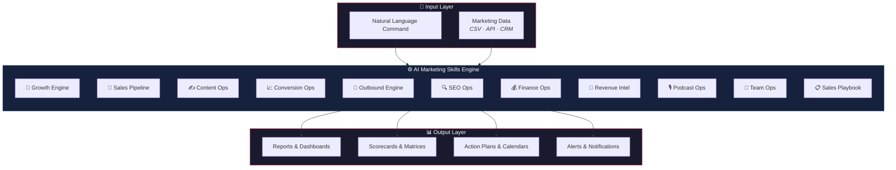
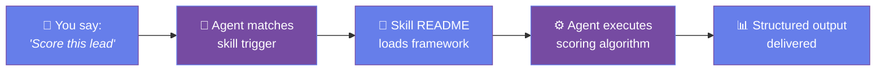
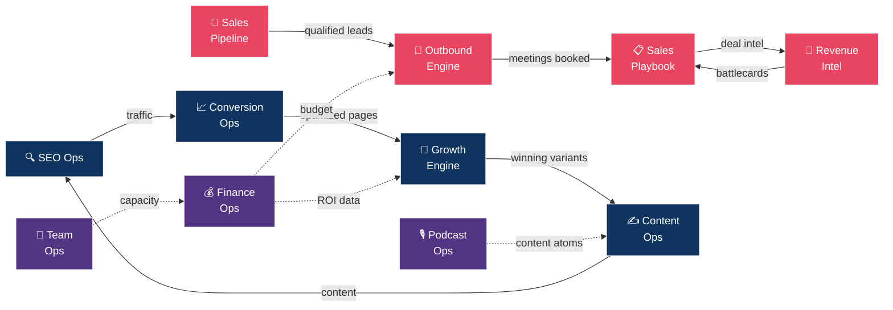

<div align="center">

# 🚀 AI Marketing Claude Skills

### Production-Ready Marketing Automation for AI Coding Agents

**11 battle-tested skills** with scoring algorithms, statistical frameworks, and actionable outputs.
Built for [Claude Code](https://docs.anthropic.com/en/docs/claude-code), [Cursor](https://cursor.sh), [OpenAI Codex](https://openai.com/codex), and any agent that supports markdown skill files.

[](#-skill-catalog)
[](LICENSE)
[](#compatibility)

---

*Turn your AI coding agent into a full-stack marketing operations team.*

</div>

## ⚡ What This Is

Each skill is a **self-contained markdown file** that transforms your AI coding agent into a specialized marketing operator. No API keys required to start — just point your agent at a skill and give it a natural language command.

> **"Run an A/B test on our pricing page"** → Growth Engine activates Bayesian testing framework
>
> **"Score this lead from Acme Corp"** → Sales Pipeline runs multi-channel intent scoring
>
> **"Audit our landing page for conversions"** → Conversion Ops runs 12-dimension CRO analysis

---

## 🏗️ Architecture Overview



---

## 📋 Skill Catalog

| # | Skill | Key Differentiations | Link |
|:-:|-------|---------------------|:----:|
| 1 | **🧪 Growth Engine** | Bayesian testing, multi-armed bandits, CUPED variance reduction, experiment dependency graphs | [→](./growth-engine/) |
| 2 | **🎯 Sales Pipeline** | Multi-channel intent scoring, AI enrichment (Clay/Apollo), predictive logistic regression, champion job tracking | [→](./sales-pipeline/) |
| 3 | **✍️ Content Ops** | Flesch-Kincaid + Dale-Chall readability, AI detection patterns, content decay monitoring, auto-refresh scheduling | [→](./content-ops/) |
| 4 | **📈 Conversion Ops** | Heatmap-aware audits, session replay archetypes, micro-conversion funnels, Cialdini 6-principle scoring | [→](./conversion-ops/) |
| 5 | **📧 Outbound Engine** | Multi-channel sequences (email+LinkedIn+video), deliverability warmup planner, timezone-aware scheduling, reply classification | [→](./outbound-engine/) |
| 6 | **🔍 SEO Ops** | GEO/AEO optimization, topical authority mapping, SERP feature win probability, cannibalization detection | [→](./seo-ops/) |
| 7 | **💰 Finance Ops** | Cohort LTV/CAC, channel unit economics, SaaS magic number, budget allocation optimizer | [→](./finance-ops/) |
| 8 | **🧠 Revenue Intelligence** | Win/loss pattern recognition (chi-square), auto-generated battlecards, pricing sensitivity cliff analysis, champion tracking | [→](./revenue-intelligence/) |
| 9 | **🎙️ Podcast Ops** | Guest fit scoring, sponsorship CPM calculator, cross-promo network mapping, audiogram automation | [→](./podcast-ops/) |
| 10 | **👥 Team Ops** | Skills gap matrix, capacity utilization tracking, 1:1 prep generator, OKR trajectory scoring | [→](./team-ops/) |
| 11 | **📋 Sales Playbook** | MEDDPICC+BANT hybrid, mutual action plans, ROI calculator with NPV, competitive displacement scoring | [→](./sales-playbook/) |

---

## 🔄 How Skills Work



Each skill folder contains a `README.md` that defines:

| Component | What It Covers |
|-----------|---------------|
| **Capabilities** | What the skill does and its key features |
| **Workflow** | Step-by-step execution sequence |
| **Triggers** | Natural language phrases that activate it |
| **Configuration** | Environment variables and setup |
| **Methodology** | Scoring frameworks with formulas and algorithms |
| **Outputs** | Report formats and deliverables |
| **Integrations** | Tools and platforms it connects with |

---

## 🚀 Quick Start

```bash
# 1. Clone the repo
git clone https://github.com/varunk130/ai-marketing-claude-skills.git

# 2. Navigate to any skill
cd ai-marketing-claude-skills/growth-engine

# 3. Read the skill README — that's the entire skill definition
cat README.md

# 4. Tell your AI agent to use it
#    "Use the growth-engine skill to design an A/B test for our homepage"
```

### Using with Claude Code
```bash
# Add as a skill directory
# Then just use natural language:
> "Run a Bayesian A/B test on our checkout flow"
> "Score and enrich this lead list"  
> "Generate a 90-day content calendar"
```

---

## 🗺️ Skill Interaction Map

Skills are designed to work independently **or** together. Here's how they connect:



<div align="center">

🔴 **Sales Track** — Lead → Outreach → Close → Intelligence loop
🔵 **Growth Track** — SEO → Conversion → Experiment → Content loop
🟣 **Ops Track** — Finance, Podcast, and Team supporting both tracks

</div>

---

## 🧰 Compatibility

| Agent | Status |
|-------|--------|
| Claude Code | ✅ Full support |
| Cursor | ✅ Full support |
| OpenAI Codex | ✅ Full support |
| Windsurf | ✅ Full support |
| GitHub Copilot | ✅ Full support |
| Any markdown-skill agent | ✅ Full support |

---

## 📁 Repository Structure

```
ai-marketing-claude-skills/
├── README.md                    ← You are here
├── growth-engine/README.md      ← Bayesian A/B testing & experimentation
├── sales-pipeline/README.md     ← Lead scoring & deal prediction
├── content-ops/README.md        ← Content quality & decay management
├── conversion-ops/README.md     ← CRO audits & funnel optimization
├── outbound-engine/README.md    ← Multi-channel outbound sequences
├── seo-ops/README.md            ← SEO + GEO/AEO optimization
├── finance-ops/README.md        ← Unit economics & budget modeling
├── revenue-intelligence/README.md ← Win/loss analysis & battlecards
├── podcast-ops/README.md        ← Podcast growth & monetization
├── team-ops/README.md           ← Team performance & capacity
└── sales-playbook/README.md     ← Deal execution & methodology
```

---

## 🤝 Contributing

This repo is protected. To contribute:

1. **Fork** the repository
2. Create a **feature branch** (`git checkout -b feature/my-skill`)
3. **Commit** your changes
4. Open a **Pull Request** — all PRs require review and approval before merging

Direct pushes to `main` are not allowed.

---

## 📄 License

MIT — use these skills however you like.

---

<div align="center">

**Built with ❤️ for the AI-native marketing team.**

*Star ⭐ this repo if these skills save you time.*

</div>
