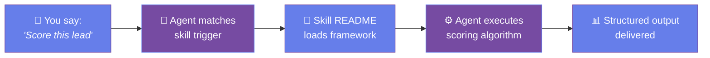
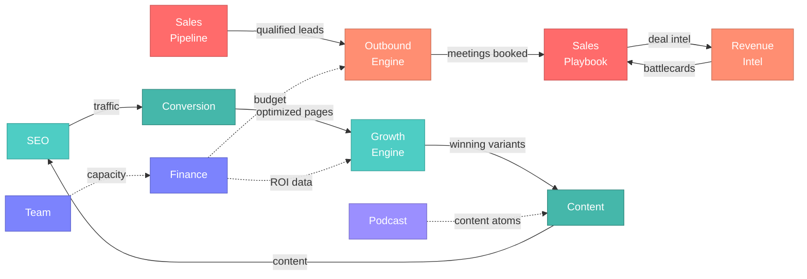

<div align="center">

# 🎯 AI Marketing Claude Skills

### AI-Powered Marketing Skills to Automate Operations and Drive Measurable ROI

Built by **[Varun Kulkarni](https://github.com/varunk130)**

**12 battle-tested skills** with scoring algorithms, statistical frameworks, and actionable outputs.
Built for [Claude Code](https://docs.anthropic.com/en/docs/claude-code), [GitHub Copilot](https://github.com/features/copilot), [Cursor](https://www.cursor.com), OpenAI Codex, and any agent that supports markdown skill files.

[](#-skill-catalog)
[](LICENSE)
[](#-compatibility)
[](https://claude.ai/code)
[](#python-runtime)

---

*Turn your AI coding agent into a full-stack marketing operations team.*

</div>

## ⚡ What This Is

Each skill is a **self-contained markdown file** that transforms your AI coding agent into a specialized marketing operator. No API keys required to start - just point your agent at a skill and give it a natural language command.

> **"Run an A/B test on our pricing page"** → Growth Engine activates Bayesian testing framework
>
> **"Score this lead from Acme Corp"** → Sales Pipeline runs multi-channel intent scoring
>
> **"Audit our landing page for conversions"** → Conversion Ops runs 12-dimension Conversion Rate Optimization (CRO) analysis

---

## 🚀 Quick Start

```bash
# 1. Clone the repo
git clone https://github.com/varunk130/ai-marketing-claude-skills.git

# 2. Navigate to any skill
cd ai-marketing-claude-skills/growth-engine

# 3. Read the skill README — that's the entire skill definition
cat README.md

# 4. Tell your AI agent to use it (Claude Code, Copilot, Cursor,
#    or any markdown-skill-aware agent)
#    "Use the growth-engine skill to design an A/B test for our homepage"
```

### Using with Claude Code

```bash
# Add as a skill directory, then just use natural language:
> "Run a Bayesian A/B test on our checkout flow"
> "Score and enrich this lead list"
> "Generate a 90-day content calendar"
```

---

## 📋 Skill Catalog

| # | Skill | Key Differentiators | Link |
|:-:|-------|--------------------|:----:|
| 1 | **Growth Engine** | Bayesian testing, multi-armed bandits, Controlled-experiment Using Pre-Experiment Data (CUPED) variance reduction, experiment dependency graphs | [→](./growth-engine/) |
| 2 | **Sales Pipeline** | Multi-channel intent scoring, AI enrichment (Clay/Apollo), predictive logistic regression, champion job tracking | [→](./sales-pipeline/) |
| 3 | **Content** | Readability scoring, AI detection patterns, content decay monitoring, auto-refresh scheduling | [→](./content-ops/) |
| 4 | **Conversion** | Heatmap-aware audits, session replay archetypes, micro-conversion funnels, Cialdini 6-principle scoring | [→](./conversion-ops/) |
| 5 | **Outbound Engine** | Multi-channel sequences (email+LinkedIn+video), deliverability warmup planner, timezone-aware scheduling, reply classification | [→](./outbound-engine/) |
| 6 | **Search Engine Optimization (SEO)** | Generative Engine Optimization (GEO) / Answer Engine Optimization (AEO), topical authority mapping, Search Engine Results Page (SERP) feature win probability, cannibalization detection | [→](./seo-ops/) |
| 7 | **Finance** | Cohort Lifetime Value (LTV) / Customer Acquisition Cost (CAC), channel unit economics, Software as a Service (SaaS) magic number, budget allocation optimizer | [→](./finance-ops/) |
| 8 | **Revenue Intelligence** | Win/loss pattern recognition (chi-square), auto-generated battlecards, pricing sensitivity cliff analysis, champion tracking | [→](./revenue-intelligence/) |
| 9 | **Podcast** | Guest fit scoring, sponsorship Cost Per Mille (CPM) calculator, cross-promo network mapping, audiogram automation | [→](./podcast-ops/) |
| 10 | **Team** | Skills gap matrix, capacity utilization tracking, 1:1 prep generator, Objectives and Key Results (OKR) trajectory scoring | [→](./team-ops/) |
| 11 | **Sales Playbook** | MEDDPICC + BANT hybrid qualification, mutual action plans, Return on Investment (ROI) calculator with Net Present Value (NPV), competitive displacement scoring | [→](./sales-playbook/) |
| 12 | **Creative** | LinkedIn ad creative testing: 3-angle variant generation, audience-aware sample sizing, sequential / Bayesian / fixed-horizon test selection, post-test diagnostic with angle-level signal | [→](./creative-ops/) |

---

## 🧠 How Skills Work


```mermaid
flowchart LR
    A["💬 You say:<br/><i>'Score this lead'</i>"] --> B["🤖 Agent matches<br/>skill trigger"]
    B --> C["📖 Skill README<br/>loads framework"]
    C --> D["⚙️ Agent executes<br/>scoring algorithm"]
    D --> E["📊 Structured output<br/>delivered"]

    style A fill:#667eea,stroke:#764ba2,color:#fff
    style B fill:#764ba2,stroke:#667eea,color:#fff
    style C fill:#667eea,stroke:#764ba2,color:#fff
    style D fill:#764ba2,stroke:#667eea,color:#fff
    style E fill:#667eea,stroke:#764ba2,color:#fff
```

Each skill folder contains a `README.md` that defines:

| Component | What It Covers |
|-----------|----------------|
| **Capabilities** | What the skill does and its key features |
| **Workflow** | Step-by-step execution sequence |
| **Triggers** | Natural language phrases that activate it |
| **Configuration** | Environment variables and setup |
| **Methodology** | Scoring frameworks with formulas and algorithms |
| **Outputs** | Report formats and deliverables |
| **Integrations** | Tools and platforms it connects with |

---

## 🗺️ Skill Interaction Map

Skills are designed to work independently **or** together. Here's how they connect:


```mermaid
graph LR
    SP["Sales<br/>Pipeline"] -->|qualified leads| OE["Outbound<br/>Engine"]
    OE -->|meetings booked| SB["Sales<br/>Playbook"]
    SB -->|deal intel| RI["Revenue<br/>Intel"]
    RI -->|battlecards| SB

    SE["SEO"] -->|traffic| CV["Conversion"]
    CV -->|optimized pages| GE["Growth<br/>Engine"]
    GE -->|winning variants| CO["Content"]
    CO -->|content| SE

    FO["Finance"] -.->|budget| OE
    FO -.->|ROI data| GE
    PO["Podcast"] -.->|content atoms| CO
    TO["Team"] -.->|capacity| FO

    style SP fill:#FF6B6B,stroke:#CC5555,color:#fff
    style OE fill:#FF8E72,stroke:#CC7159,color:#fff
    style SB fill:#FF6B6B,stroke:#CC5555,color:#fff
    style RI fill:#FF8E72,stroke:#CC7159,color:#fff
    style SE fill:#4ECDC4,stroke:#3BA39B,color:#fff
    style CV fill:#45B7AA,stroke:#368A80,color:#fff
    style GE fill:#4ECDC4,stroke:#3BA39B,color:#fff
    style CO fill:#45B7AA,stroke:#368A80,color:#fff
    style FO fill:#7C83FD,stroke:#5F65CC,color:#fff
    style PO fill:#9B8FFF,stroke:#7A70CC,color:#fff
    style TO fill:#7C83FD,stroke:#5F65CC,color:#fff
```

<div align="center">

| Track | Skills | Flow |
|:------|:-------|:-----|
| 🔴 **Sales & Revenue** | Sales Pipeline → Outbound → Playbook → Revenue Intel | Lead to close loop |
| 🟢 **Growth & Content** | SEO → Conversion → Growth Engine → Content | Traffic to optimization loop |
| 🔵 **Operations** | Finance · Podcast · Team | Cross-functional support layer |

</div>

---

## 🧰 Compatibility

| Agent | Status |
|-------|--------|
| Claude Code | ✅ Full support |
| Cursor | ✅ Full support |
| OpenAI Codex | ✅ Full support |
| Windsurf | ✅ Full support |
| GitHub Copilot | ✅ Full support |
| Any markdown-skill agent | ✅ Full support |

---

## 📁 Repository Structure

```text
ai-marketing-claude-skills/
├── README.md                          ← You are here
├── growth-engine/README.md            ← Bayesian A/B testing & experimentation
├── sales-pipeline/README.md           ← Lead scoring & deal prediction
├── content-ops/README.md              ← Content quality & decay management
├── conversion-ops/README.md           ← CRO audits & funnel optimization
├── outbound-engine/README.md          ← Multi-channel outbound sequences
├── seo-ops/README.md                  ← SEO + GEO/AEO optimization
├── finance-ops/README.md              ← Unit economics & budget modeling
├── revenue-intelligence/README.md     ← Win/loss analysis & battlecards
├── podcast-ops/README.md              ← Podcast growth & monetization
├── team-ops/README.md                 ← Team performance & capacity
├── sales-playbook/README.md           ← Deal execution & methodology
├── creative-ops/README.md             ← LinkedIn creative variant testing
├── python_runtime/                    ← Shared scoring, statistical, and IO helpers
├── examples/                          ← Runnable usage examples
└── tests/                             ← unittest suite for the runtime
```

---

## Python Runtime

In addition to the skill contracts (Markdown), this repo ships a small `python_runtime/` package with shared scoring, statistical, and IO helpers that skill executors can call into.

Requires **Python 3.10+**.

```bash
# Run the example
python examples/run_skill.py

# Run the unit tests
python -m unittest discover -v

# Try the CLI
python -m python_runtime.cli score-lead --features '{"title_match":80,"engagement":70}'
python -m python_runtime.cli ci --successes 120 --trials 1000
python -m python_runtime.cli sample-size --baseline 0.05 --mde 0.01
```

**Zero runtime dependencies** - pure Python standard library. Tests use the built-in `unittest` module.

---

## 🤝 Contributing

The `main` branch is protected. To contribute:

1. **Fork** the repository
2. Create a **feature branch** (`git checkout -b feature/my-skill`)
3. **Commit** your changes
4. Open a **Pull Request** - all PRs require review and approval before merging

Direct pushes to `main` are not allowed.

---

## Related Work

Part of a portfolio of AI agent and skill libraries for product, GTM, and decision-making teams.

**Discovery & research**

- [ai-customer-discovery-skills](https://github.com/varunk130/ai-customer-discovery-skills) - Turn raw customer signal into validated product opportunities (12 skills planned)
- [jtbd-extractor](https://github.com/varunk130/jtbd-extractor) - Extract Jobs-to-be-Done statements from research, with opportunity scoring

**Strategy & decisions**

- [claude-code-skills](https://github.com/varunk130/claude-code-skills) - 29 production-grade skills for finance, product, strategy, and game theory
- [AI-Builder-Decision-Analyst](https://github.com/varunk130/AI-Builder-Decision-Analyst) - 11 skills that catch bad bets before you ship across DECIDE / BUILD / COMMUNICATE / LEARN

**Go-to-market**

- [ai-gtm-skill-library](https://github.com/varunk130/ai-gtm-skill-library) - 31 opinionated GTM skills across the full discover -> renew lifecycle
- [ai-partner-ecosystem-analysis](https://github.com/varunk130/ai-partner-ecosystem-analysis) - Deep research on any ISV, partner, or competitor with a 1-slide PPTX output

**UX & design**

- [ai-ux-skill-library](https://github.com/varunk130/ai-ux-skill-library) - 12 frameworks for designing UX for AI products, agents, and AI-powered experiences

**Multi-agent demos**

- [ai-pm-agents-suite](https://github.com/varunk130/ai-pm-agents-suite) - 6-agent pipeline plus 3 standalone PM agents (decision engine, financial analyst, stakeholder translator) that turn customer feedback into strategy, PRDs, and comms
- [ai-legal-team-agent](https://github.com/varunk130/ai-legal-team-agent) - 4-agent legal analysis team with Python orchestrator and Claude Code skills

**Evaluation & operations**

- [AI-Eval-Skills](https://github.com/varunk130/AI-Eval-Skills) - 6 skills to plan, generate, run, interpret, and triage AI agent evaluations
- [ai-workflow-playbooks](https://github.com/varunk130/ai-workflow-playbooks) - 21 playbooks + 10 skills + 4 guardians + 5 runbooks across the 7-stage delivery pipeline

---

## 📄 License

MIT — see [LICENSE](LICENSE) for the full text. Use these skills however you like.

---

<div align="center">

*Star ⭐ this repo if these skills save you time.*

**Built by [Varun Kulkarni](https://github.com/varunk130)** · *Powered by Claude Code Opus 4.7 + GitHub Copilot*

</div>
